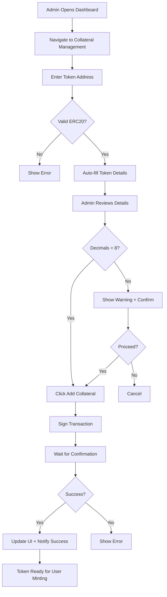

# Collateral Management Feature

## Overview
Added a new admin interface for managing collateral tokens in the BTC1 protocol. This allows administrators to easily add new BTC-backed tokens as accepted collateral through the dashboard UI.

## Features Implemented

### 1. Collateral Management Component (`components/collateral-management.tsx`)
A new React component that provides a comprehensive interface for managing collateral tokens:

#### Add Collateral Section
- **Token Address Input**: Enter the ERC20 contract address
- **Auto-fill Feature**: Automatically fetch token symbol and name from contract
- **Manual Entry**: Option to manually enter token symbol and name
- **Token Validation**: 
  - Verifies the address is a valid ERC20 token
  - Checks token decimals (warns if not 8 decimals)
  - Prevents adding duplicate collateral
  - Confirms admin authorization

#### Current Supported Collaterals Section
- **Live Display**: Shows all currently supported collateral tokens
- **Token Details**: 
  - Symbol and name
  - Contract address
  - Current vault balance
- **Remove Option**: Remove collateral tokens (only if vault balance is zero)

#### Transaction Feedback
- Real-time transaction status updates
- Success/error notifications
- Automatic refresh after successful operations

### 2. Updated Contract ABIs (`lib/contracts.ts`)
Enhanced the Vault ABI to include collateral management functions:
- `addCollateral(address token)`: Add new collateral token
- `removeCollateral(address token)`: Remove collateral token
- `supportedCollateral(address token)`: Check if token is supported
- `collateralBalances(address token)`: Get vault balance for token
- `CollateralAdded` event
- `CollateralRemoved` event

### 3. Dashboard Integration (`components/dashboard.tsx`)
Added new navigation items:
- **"Collateral Management"** tab: Main interface for adding/removing collateral (Admin only)
- **"Test Mint Collateral"** tab: Renamed from "Collateral Minting" for clarity - used for testing only

The tabs are organized in the admin section of the sidebar navigation.

## How to Use

### Adding a New Collateral Token

1. **Navigate to Dashboard**: Access the admin dashboard
2. **Select "Collateral Management"**: Click on the tab in the sidebar
3. **Enter Token Address**: 
   - Paste the ERC20 token contract address
   - Click "Auto-fill" to fetch token details automatically
   - Or manually enter Symbol and Name
4. **Add Collateral**: Click the "Add Collateral Token" button
5. **Confirm Transaction**: Approve the transaction in your wallet
6. **Verification**: The token will automatically appear in the "Current Supported Collaterals" list

### Process Flow



## Smart Contract Integration

The feature integrates with the existing Vault contract methods:

### Vault.sol Functions Used
```solidity
function addCollateral(address token) external onlyAdmin {
    require(!supportedCollateral[token], "Vault: already supported");
    supportedCollateral[token] = true;
    collateralTokens.push(token);
    emit CollateralAdded(token);
}

function removeCollateral(address token) external onlyAdmin {
    require(supportedCollateral[token], "Vault: not supported");
    require(collateralBalances[token] == 0, "Vault: collateral has balance");
    // Remove from array...
    supportedCollateral[token] = false;
    emit CollateralRemoved(token);
}
```

### Security Features
- **Admin Only**: All collateral management functions require admin authorization
- **Zero Balance Check**: Cannot remove collateral with outstanding vault balance
- **Duplicate Prevention**: Cannot add the same token twice
- **ERC20 Validation**: Verifies token is a valid ERC20 before adding

## User Impact

### For Users
- **Seamless Experience**: Once admin adds collateral, users can immediately use it for minting
- **More Options**: Users get more choices for collateral tokens
- **No Action Required**: Existing functionality continues to work

### For Admins
- **Easy Management**: Simple UI for adding new collateral types
- **Real-time Updates**: Immediate feedback on operations
- **Safety Checks**: Built-in validation prevents errors

## Example: Adding cbBTC v2

1. Get cbBTC v2 contract address from Base network
2. Open Collateral Management tab
3. Paste address: `0x...` (cbBTC v2 address)
4. Click "Auto-fill" → System fetches "cbBTC" and "Coinbase Wrapped Bitcoin"
5. Click "Add Collateral Token"
6. Sign transaction
7. ✅ Success! Users can now mint BTC1 using cbBTC v2

## Technical Notes

### Token Requirements
- Must be a valid ERC20 token
- Ideally should have 8 decimals (BTC standard)
- Should represent legitimate BTC collateral
- Must be deployed on the same network as the protocol

### Gas Considerations
- Adding collateral: ~100,000 gas
- Removing collateral: ~50,000 gas

### Frontend Dependencies
- `ethers.js v6`: Contract interactions
- `wagmi`: Wallet connection
- React hooks: State management
- Shadcn/ui: UI components

## Future Enhancements

Possible improvements:
1. **Batch Operations**: Add multiple tokens at once
2. **Collateral Limits**: Set maximum allocation per token
3. **Collateral Weights**: Different pricing for different tokens
4. **Oracle Integration**: Add price feed requirements
5. **Governance Integration**: Community voting for new collateral
6. **Whitelist**: Pre-approved token list
7. **Analytics**: Track collateral usage metrics

## Testing Checklist

- [x] Admin can add new collateral token
- [x] Admin can remove collateral (if balance is zero)
- [x] Non-admin cannot access collateral management
- [x] Token validation works correctly
- [x] Auto-fill retrieves correct token data
- [x] UI updates after successful operations
- [x] Error handling displays appropriate messages
- [x] Cannot add duplicate tokens
- [x] Cannot remove tokens with vault balance
- [x] Users can mint with newly added collateral

## Security Considerations

1. **Admin Authorization**: Only protocol admin can manage collateral
2. **Token Verification**: ERC20 compliance checked before adding
3. **Balance Protection**: Cannot remove collateral with active deposits
4. **Transaction Safety**: All operations require wallet signature
5. **Event Logging**: All operations emit blockchain events for transparency

## Conclusion

This feature provides a robust, user-friendly interface for protocol administrators to manage collateral tokens. It streamlines the process of adding new BTC-backed tokens while maintaining security and preventing errors through comprehensive validation and safeguards.
